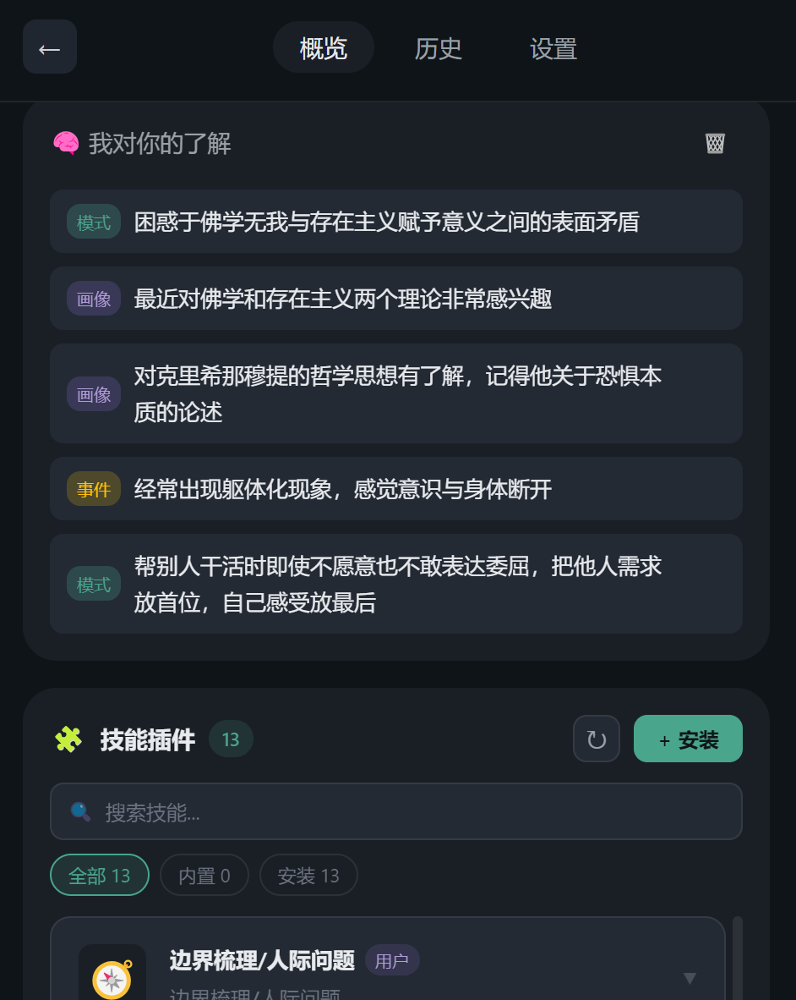
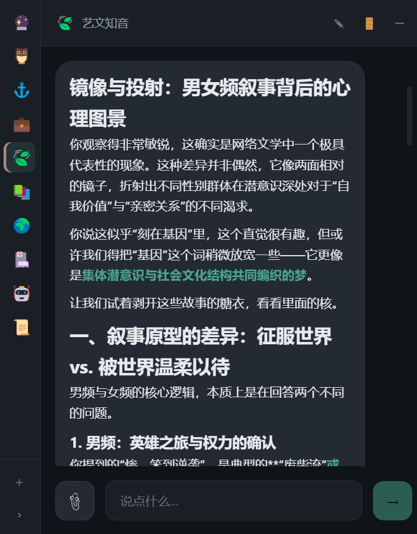

<div align="center">

# ⚓ Anchor

**你的桌面正念助手**

*在忙碌的工作中，给自己一个可以停泊的港湾*

[](https://www.electronjs.org/)
[](https://vuejs.org/)
[](https://www.typescriptlang.org/)

</div>

---

## 🌟 产品简介

**Anchor** 是一款轻量级的桌面正念辅助工具。它安静地驻留在你的系统托盘中，在你需要时随时唤起，帮助你快速平复情绪、梳理思绪、或者只是做一个简单的呼吸练习。

无论你是面临工作压力、人际困扰，还是只想在繁忙中按下暂停键，Anchor 都能在 5 分钟内帮助你重新找到内心的平静。

### ✨ 核心特色

- **🎯 AI 智能对话** - 基于大语言模型，提供温暖、共情的对话体验
- **🛠️ 结构化工具** - 三大正念工具，覆盖情绪急救到长期价值观建设
- **👁️ 隐私友好** - 极简黑白界面，看起来就像在回消息，不尴尬
- **⚡ 轻量驻留** - 系统托盘常驻，热键一键唤醒 (`Ctrl+Alt+A`)
- **🧠 长期记忆** - 升级版向量记忆系统，提供连贯陪伴体验

---

## 📸 界面展示

| 概览 | 对话 |
| :---: | :---: |
|  |  |

---

## 🧘 核心功能

### 💬 智能对话

与 AI 进行自然的对话。它不是冰冷的机器人，而是一个善于倾听的朋友：

- **意图识别** - 自动识别你是想闲聊、需要帮助、还是正在经历情绪困扰
- **工具推荐** - 在合适的时机，自然地建议使用某个工具
- **上下文记忆** - 记住你之前说过的话，对话更连贯
- **流式响应** - 打字机效果展示回复，体验更自然

### 🎨 图片生成

支持多种尺寸的图片生成能力：
- 正方形 (1:1)、横屏 (16:9)、竖屏 (9:16)、4:3 比例
- 只需用自然语言描述你想要的画面

---

## 🛠️ 三大正念工具

<table>
<tr>
<td width="50%">

### 🚨 急救引导器
**适用场景**：情绪崩溃、焦虑惊恐、反刍思维

四阶段引导流程：
1. **极速着陆** - 5-4-3-2-1 感官练习，快速拉回现实
2. **问题澄清** - 2-3 轮对话，理清困扰的核心
3. **认知改写** - ACT 接纳承诺疗法，温柔解构痛苦想法
4. **反馈收集** - 练习结束，收集体验反馈

</td>
<td width="50%">

### 🌬️ 静默呼吸
**适用场景**：需要快速平复、保持专注

简约的视觉呼吸引导：
- **4-4-4 节奏** - 吸气、保持、呼气各 4 秒
- **4-7-8 节奏** - 经典助眠呼吸法
- **柔和动画** - 圆圈随呼吸膨胀收缩
- **不打扰** - 极简界面，可在工作时使用

</td>
</tr>
<tr>
<td width="50%" colspan="2">

### 🧭 价值观雷达
**适用场景**：面临选择时内耗、不清楚自己真正看重什么

渐进式价值观探索：
1. **话题选择** - 职业、关系、自我等多个话题
2. **情境问答** - 5 轮选择题，逐步挖掘内心
3. **雷达图结果** - 直观展示你的价值观画像

覆盖八大价值维度：自主性、成就感、安全感、关系连接、成长学习、创造表达、公平正义、享乐体验

</td>
</tr>
</table>

---

## 🚀 快速开始

### 环境要求

- Node.js 18+
- npm 或 pnpm

### 安装与运行

```bash
# 克隆项目
git clone https://github.com/your-username/anchor.git
cd anchor

# 安装依赖
npm install

# 发行版调试运行
npm run prod

# 打包桌面应用
npm run build
```

---

## 🎹 使用技巧

| 快捷键 | 功能 |
|--------|------|
| `Ctrl+Alt+A` | 全局热键，显示/隐藏窗口 |
| `Enter` | 发送消息 |
| 点击托盘图标 | 显示/隐藏窗口 |

### 🚪 侧边栏功能

点击右上角的「门」图标，可以：
- 查看历史会话列表
- 切换到之前的对话
- 查看价值观长期雷达图

---

## 🧠 智能特性

### 长期记忆系统

Anchor 会在流式对话中基于上下文自动提取有价值的信息，通过独立的轻量模型服务将其形成三层记忆：

| 类型 | 说明 | 示例 |
|------|------|------|
| **Profile** | 长期稳定的用户画像 | "在乎自主性，不喜欢被安排" |
| **Pattern** | 行为/情绪模式 | "周一容易焦虑" |
| **Episode** | 短期情境记忆 | "最近在准备面试" |

这些提取出的记忆都会经过**向量化嵌入**（Embedding）处理并持久化存储。在后续对话中，系统会进行精确检索与召回，让 AI 真正做到"更懂你"。

---

## 🎨 设计理念

### 为什么叫 Anchor？

> 锚，是船只在风浪中稳定自身的依靠。
>
> 我们希望这个小工具能成为你在忙碌生活中的一个"锚点"——
> 当情绪的波涛来袭时，你知道有一个地方可以停泊、可以喘息。

### 设计原则

1. **极简不打扰** - 黑白灰配色，看起来像在回消息
2. **先冷静再行动** - 工具设计遵循"先着陆，后认知"原则
3. **主体性归还** - AI 不替你做决定，只帮你看清全貌
4. **渐进式引导** - 通过结构化流程，而非长篇说教

---

## 🤝 贡献

欢迎提交 Issue 和 Pull Request！

如果你有新的工具想法，或者发现了任何问题，请通过 Issue 告诉我们。

---

## 📄 许可证

本项目采用 **署名-非商业性使用 4.0 国际 (CC BY-NC 4.0)** 许可协议。
